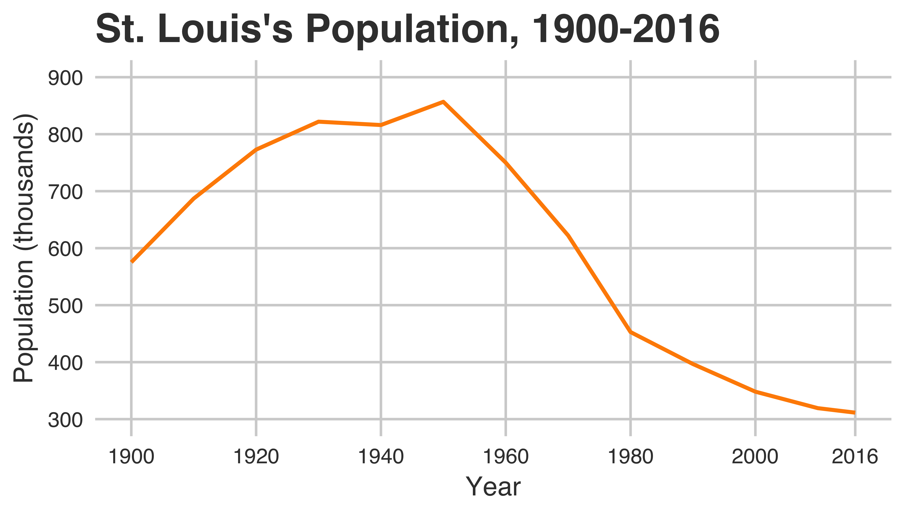

Two related demographic phenomena have helped define contemporary St. Louis: population loss and segregation. The plot above shows the significant drop in population the city has experienced since 1950, when it experienced a peak population 856,796. As of 2016, the population sat at 311,404. This 64% decline in the city's population has left a hollowed out urban space, with streets and neighborhoods designed to accommodate hundreds of thousands more residents than currently exist in the city. 

St. Louis is not alone in this trend of what academics have taken to calling the "shrinking city" phenomenon. Detroit, Baltimore, Cleveland, Buffalo, and other [rust belt](https://en.wikipedia.org/wiki/Rust_Belt) cities all experienced decline to varying degrees after the 1960s, driven by a precipitous drop in manufacturing jobs and the social consequences that widespread unemployment brought.

Many of these cities also share a legacy of pernicious racial residential segregation. Driven by racially motivated zoning, restrictive covenants, and redlining, African Americans were hemmed into less desirable neighborhoods. The legacy of these structural inequalities is still evident in St. Louis, where a significant proportion of the city's African American population resides north of Delmar Boulevard. 
