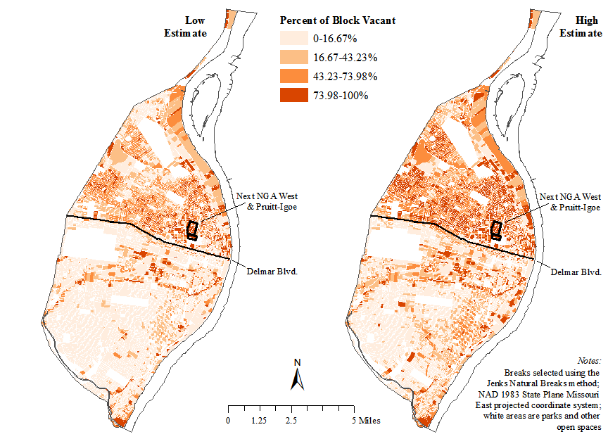
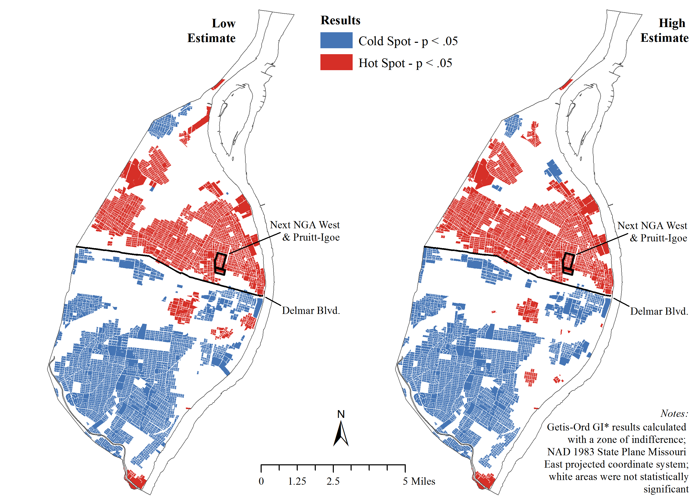

When we analyzed the measures of vacancy produced using our [approach for 2017](/approach17), we found a total of 32,431 vacant parcels in the low estimate and 48,013 in the high estimate. These estimates were much higher than what had previously been documented (see our [FAQ](/faq)). We did not take steps to adjudicate which of the two estimates was "right", but rather focused on the degree to which both estimates support our hypothesis of clustered vacancy in the city.

  

Our initial analysis showed particularly high concentrations of vacant properties in North St. Louis. The level of clustering that was observed with the naked eye in the map above was also measured using statistics designed to take geography into account ("spatial statistics"). 

  

The second map identified the clustering of vacant properties as "hot spots" - areas that had higher than average concentrations of vacancy. This clustering was similar in both the low and the high estimates, though the exact number of blocks included in the hot spots differed between the two. 

As a final step, we used additional spatial statistical models to look at the factors that might be driving vacancy. [Our paper](https://dx.doi.org/10.17605/OSF.IO/BC7EH) contains full statistical tables. There were two main factors that we identified that were associated with vacancy. These factors held between both the low and the high estimates, giving us confidence that the general narrative we identified was not a product of idiosyncrasies within one of the data sets that did not generalize.

First, as the population of African Americans in a given area of the city increased, so too did the proportion of that area that was vacant. Second, areas that had seen population growth since 1970 had lower rates of vacancy, while those areas that had population shrinkage had higher rates of vacancy. We concluded, therefore, that vacancy in St. Louis appeared to be a product of the twin forces of segregation and deindustrialization - as jobs left the region and residents left the city, it was African American neighborhoods on the city's north side that bore the brunt of increasing vacancy.
